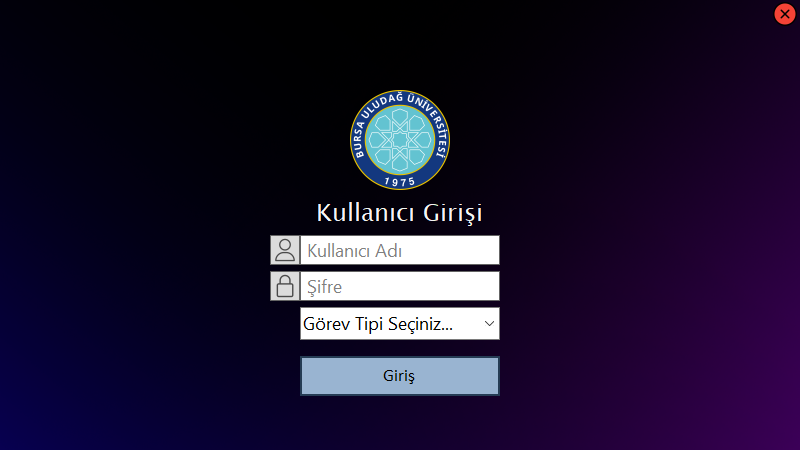
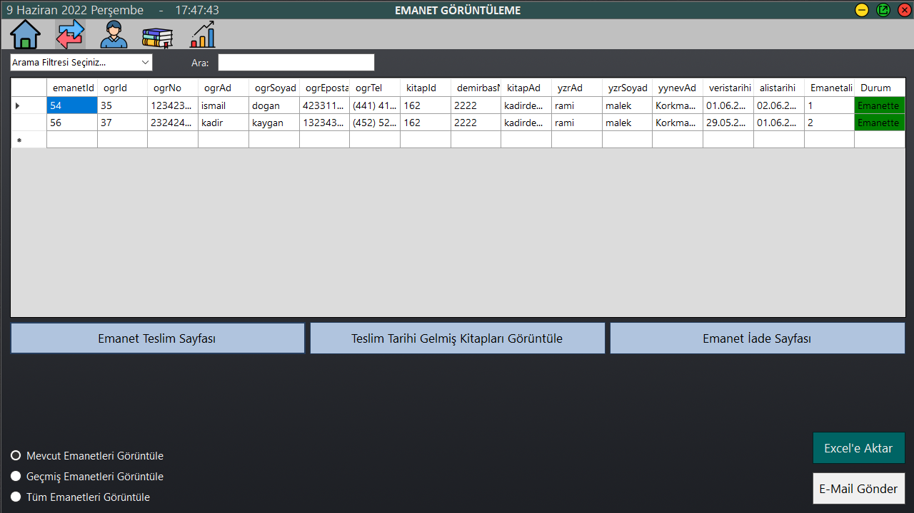
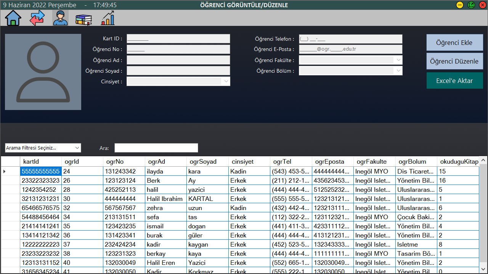

<h1> SourceSoftware-Kütüphane-Otomasyonu <h1>

<h2> Amaç ve Kapsam: <h2>

Projedeki temel gayemiz okulumuzun kütüphanesindeki kitapların verilerini saklamak ve kitapları ödünç alan öğrencilerin detaylı bir şekilde verilerinin tutulmasını sağlamak
amacıyla personel ve öğrenci işlerinin kullanacağı gelişmiş bir kütüphane otomasyonu sunmaktır.
Otomasyonu kütüphane görevlisi ve öğrenci işleri kullanacaktır, öğrencinin herhangi bir erişimi olmayacaktır.

<h2> Hedefler ve Başarı Kriterleri: <h2>

-Projemizin öncelikli hedeflerinden birisi otomasyonun sorunsuz bir şekilde çalışmasını sağlamak, 

-Kitap veya öğrenci kaydı girildiğinde sorunsuz bir şekilde veri tabanına kaydedebilmek,

-Ödünç aldığı kitabi getirmeyen öğrenciye mail gönderilmesini sağlamak,

-Emanet sisteminin sorunsuz bir şekilde çalışmasını sağlamak,

-Eğitim kalitesi için bu sistem geri bildirimleri uygun şekilde desteklemek,

-Görevli kütüphane görevlisinin yetkileri dahilinde ulaşması gereken bilgilere ulaşabilmesini sağlamak,

-Öğrenci işlerindeki görevlinin yetkileri dahilinde ulaşması gereken bilgilere ulaşabilmesini sağlamak,

-Kitap veya öğrenci bilgilerini eksiksiz getirmek,

-Öğrenci kayıt ve personel sisteminin sorunsuz çalışmasını sağlamak,

-Kitap veya öğrenci ekleme, okuma, güncelleme, silme işlemlerinin sorunsuz bir şekilde çalışmasını sağlamak,

-İstatistik kısmının, otomasyonun ihtiyacı doğrultusunda eksiksiz bir şekilde, bizden istenen verilerin ve değerlerin çekilmesinin sağlamak,

-Emanet sisteminde öğrencinin hangi kitabı aldığını ve hangi tarihte kütüphaneye teslim etmesini sağlayan sistemin çalışmasını sağlamak.

<h3> Genel Bakış: <h3>

Kütüphane otomasyonumuz öğrenci ve kitaplar arasındaki her türlü işlemi yapabilecek, verileri saklayabilecek son derece basit ve sade bir kullanıma sahip bilgisayar destekli bir uygulamadır.

<h4> Giriş Ekranı: <h4>

Programa giriş yaparken üç farklı seçenekle giriş yapabiliyoruz.
  
  

<h4> Anasayfa Ekranı: <h4>

Anasayfada emanet, öğrenci, kitap, istatistik ve mail gönderme sayfalarına erişim sağlanır.
  
  
  

<h4> Emanet Sayfaları: <h4>

Emanet işlemlerinde; emanetin görüntülenmesi, emanetin ödünç olarak verilmesi ve geri alınması işlemleri yapılır. 
  
  
  
  
  

<h4> Öğrenci Sayfaları: <h4>

Öğrenci sayfalarında; öğrencilerin görüntülenmesi, öğrencilerin sisteme eklenmesi ve öğrenci bilgilerinin düzenlenmesi işlemleri yapılır.
  
  
  
  

<h4> Kitap Sayfaları: <h4>

Kitap sayfalarında; kitapların görüntülenmesi, kitapların sisteme eklenmesi ve kitap bilgilerinin düzenlenmesi işlemleri yapılır.
  
  
  
  

<h4> İstatistik Sayfası: <h4>

İstatistik verilerin görüntülenmesi ve grafik verilerinin görüntülenmesi işlemleri yapılır. 
  
  
  
  
  

<h4> Öğrenci İşleri Sayfası: <h4>

Öğrenci işleri sayfasında öğrencinin emanette bulunan kitabı var olup olmadığı kontrol edilip gerekli durumda belge verilmesi işlemi yapılır.
  
  
  

<h4> Mail Gönderme Sayfası: <h4>

Öğrenciye mail gönderilmesi işlemi yapılır.
  
  
  

